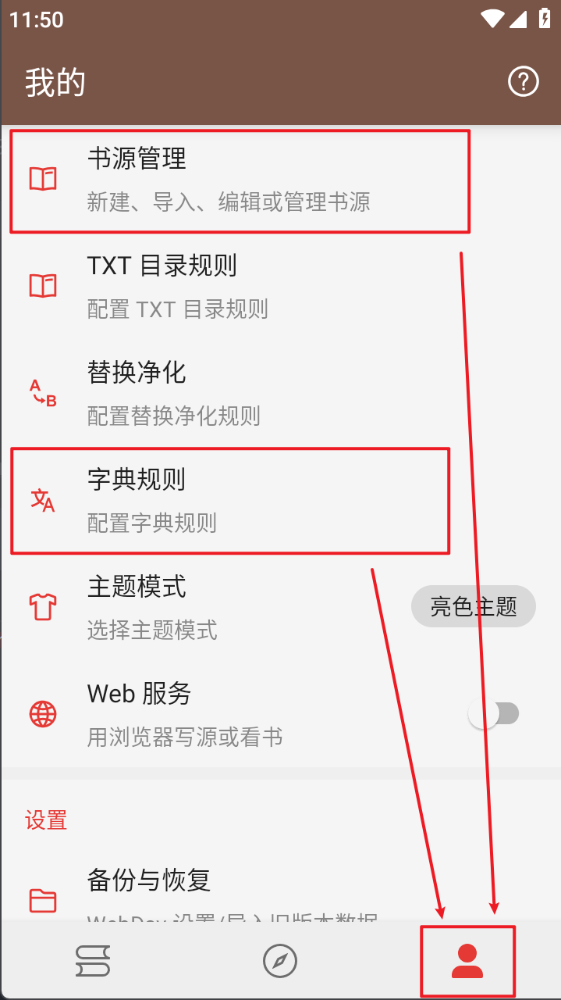
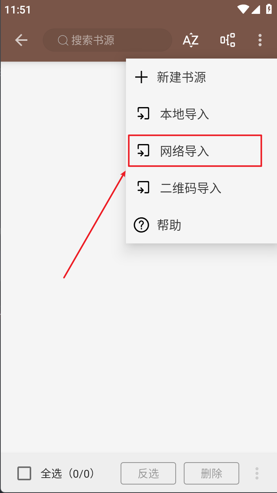
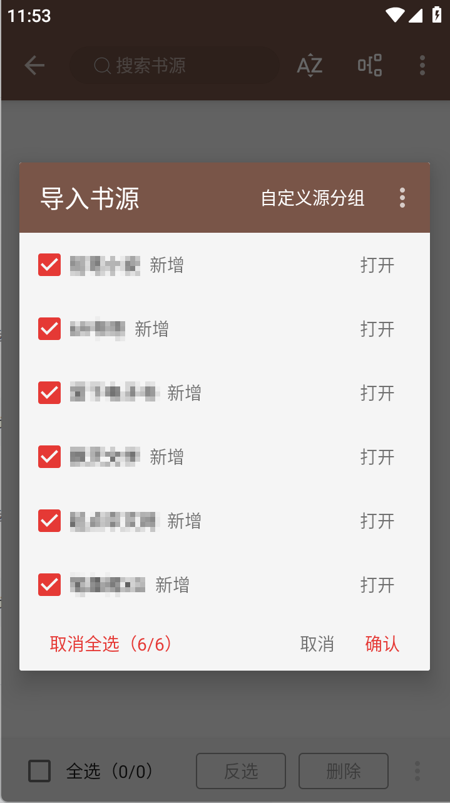
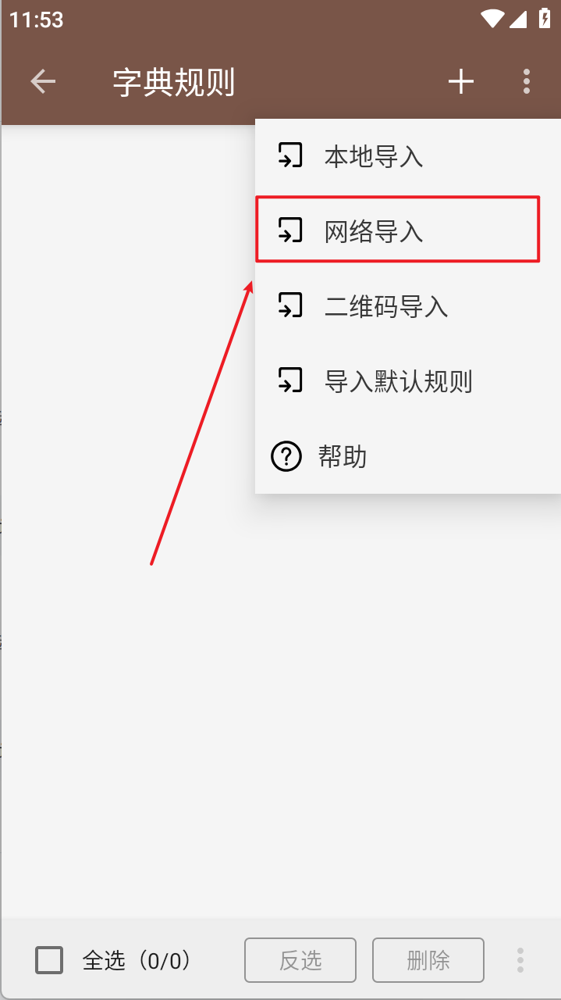
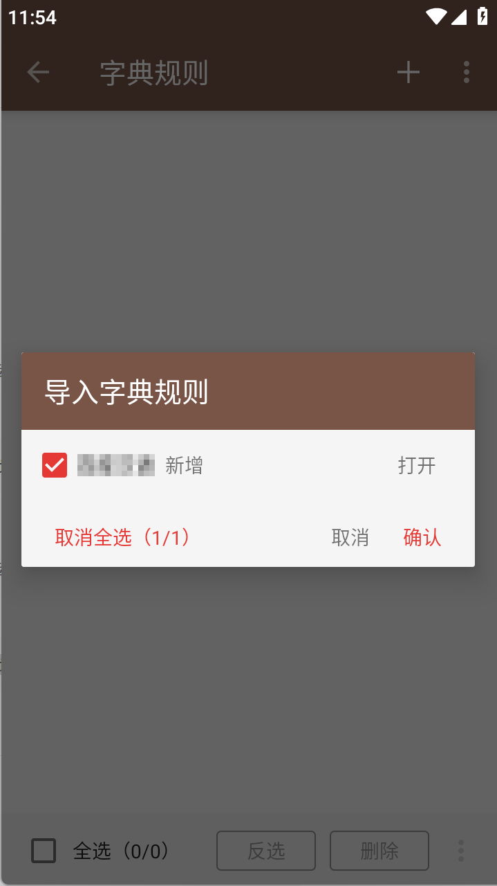

# Legado-Adaptation-Plan

本项目为 Legado 项目的第三方书源项目，旨在为 Legado APP 提供额外的阅读体验。  

Legado 项目地址 : [https://github.com/gedoor/legado](https://github.com/gedoor/legado)  


## 使用说明


### 软件安装

前往 Legado 项目的 Releases 页面，下载并安装最新的 `.apk` 文件。  

Legado Releases : [https://github.com/gedoor/legado/releases](https://github.com/gedoor/legado/releases)  


### 规则导入

本项目有书源规则和字典规则可供导入，实际为导入项目中的 `src/BookSource.json` 文件和 `src/DictSource.json` 文件。  

> 若无法导入，请检查网络与 GitHub 网站是否能够正常连通，或选择下载目标文件进行本地导入操作。  


#### 书源导入

打开 Legado APP 软件，进入 【我的】 页面，进入 【书源管理】 页面，找到 【网络导入】 选项。  

在 【网络导入】 的 URL 地址输入栏中填入以下地址，然后确认即可。  

```
https://raw.githubusercontent.com/Dancying/Legado-Adaptation-Plan/main/src/BookSource.json
```

  


#### 字典源导入

打开 Legado APP 软件，进入 【我的】 页面，进入 【字典规则】 页面，找到 【网络导入】 选项。  

在 【网络导入】 的 URL 地址输入栏中填入以下地址，然后确认即可。  

```
https://raw.githubusercontent.com/Dancying/Legado-Adaptation-Plan/main/src/DictSource.json
```

  


## 开源协议

本项目使用 MIT 许可证。  

```
MIT License

Copyright (c) 2024 Dancying

Permission is hereby granted, free of charge, to any person obtaining a copy
of this software and associated documentation files (the "Software"), to deal
in the Software without restriction, including without limitation the rights
to use, copy, modify, merge, publish, distribute, sublicense, and/or sell
copies of the Software, and to permit persons to whom the Software is
furnished to do so, subject to the following conditions:

The above copyright notice and this permission notice shall be included in all
copies or substantial portions of the Software.

THE SOFTWARE IS PROVIDED "AS IS", WITHOUT WARRANTY OF ANY KIND, EXPRESS OR
IMPLIED, INCLUDING BUT NOT LIMITED TO THE WARRANTIES OF MERCHANTABILITY,
FITNESS FOR A PARTICULAR PURPOSE AND NONINFRINGEMENT. IN NO EVENT SHALL THE
AUTHORS OR COPYRIGHT HOLDERS BE LIABLE FOR ANY CLAIM, DAMAGES OR OTHER
LIABILITY, WHETHER IN AN ACTION OF CONTRACT, TORT OR OTHERWISE, ARISING FROM,
OUT OF OR IN CONNECTION WITH THE SOFTWARE OR THE USE OR OTHER DEALINGS IN THE
SOFTWARE.

```

