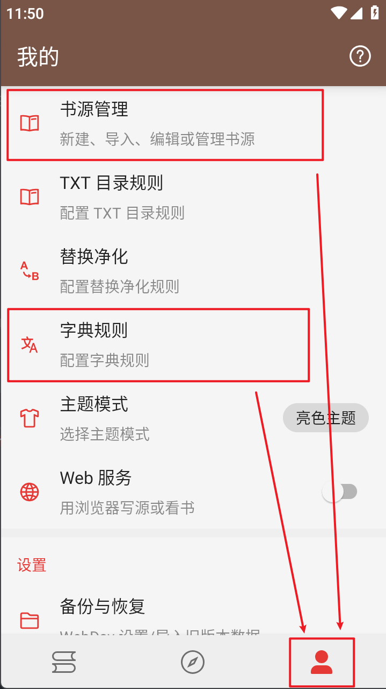
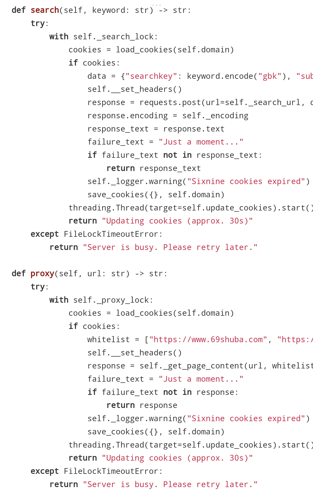

# Legado-Adaptation-Plan

本项目是 **开源阅读 APP** 的第三方书源项目，项目中的书源只会根据个人需求进行增减。    

开源阅读 APP 项目地址 : <https://github.com/gedoor/legado>    


## 📖 使用说明

在 **开源阅读 APP** 中粘贴书源导入链接地址即可使用。  


### 1. 安装软件

首先前往 **开源阅读 APP** 的 `Releases` 页面，找到最新的 `.apk` 文件下载并安装：  

Legado Releases : <https://github.com/gedoor/legado/releases>    


### 2. 导入书源

启动 **开源阅读 APP** 应用，进入 【我的】 页面，进入 【书源管理】 页面，找到 【网络导入】 选项。  

在 【网络导入】 的 URL 地址输入栏中填入以下地址，点击确认后勾选需要导入的书源配置。    

```
https://api.dancying.cn/legado/BookSource.json
```

<br>

<br>

> [!IMPORTANT]  
> 项目中 PROXY 分组的书源使用云服务器代理请求，偶尔服务器异常会导致该分组下的书源不可用。  
> 项目中的书源都是在 `legado_app_3.25` 的开源阅读 APP 版本上编写或优化。  


## 🛠️ 服务部署

项目中 PROXY 分组的书源使用云服务器代理请求，如果需要使用自己的服务器可以根据以下步骤部署。  

> 部分代理场景需要使用浏览器，所需依赖较多，故只推荐容器化部署。  


### 1. 构建镜像

克隆项目仓库到本地，然后在项目根目录中执行以下命令构建 podman 镜像：  

```shell
podman build -t localhost/novel-service:latest .
```


### 2. 运行镜像

执行以下命令运行已构建的镜像：  

```shell
podman run -d \
  --name novel-service \
  --restart always \
  -p 39966:39966 \
  -e BASE_URL="https://api.dancying.cn" \
  --shm-size=1g \
  --log-opt max-size=20mb \
  --log-opt max-file=3 \
  localhost/novel-service:latest
```

> 运行命令中的 `BASE_URL` 参数需要自行替换为云服务器的实际地址。  


### 3. 反向代理

如果需要反向代理，可以参考以下 Nginx 配置：  

```nginx
location /legado/ {
    proxy_pass http://127.0.0.1:39966;
    proxy_set_header Host $host;
    proxy_set_header X-Real-IP $remote_addr;
    proxy_set_header X-Forwarded-For $proxy_add_x_forwarded_for;
    proxy_set_header X-Forwarded-Proto $scheme;
}
```


## ©️ 开源协议

本项目使用 MIT 许可证。  

```
MIT License

Copyright (c) 2024 Dancying

Permission is hereby granted, free of charge, to any person obtaining a copy
of this software and associated documentation files (the "Software"), to deal
in the Software without restriction, including without limitation the rights
to use, copy, modify, merge, publish, distribute, sublicense, and/or sell
copies of the Software, and to permit persons to whom the Software is
furnished to do so, subject to the following conditions:

The above copyright notice and this permission notice shall be included in all
copies or substantial portions of the Software.

THE SOFTWARE IS PROVIDED "AS IS", WITHOUT WARRANTY OF ANY KIND, EXPRESS OR
IMPLIED, INCLUDING BUT NOT LIMITED TO THE WARRANTIES OF MERCHANTABILITY,
FITNESS FOR A PARTICULAR PURPOSE AND NONINFRINGEMENT. IN NO EVENT SHALL THE
AUTHORS OR COPYRIGHT HOLDERS BE LIABLE FOR ANY CLAIM, DAMAGES OR OTHER
LIABILITY, WHETHER IN AN ACTION OF CONTRACT, TORT OR OTHERWISE, ARISING FROM,
OUT OF OR IN CONNECTION WITH THE SOFTWARE OR THE USE OR OTHER DEALINGS IN THE
SOFTWARE.
```
