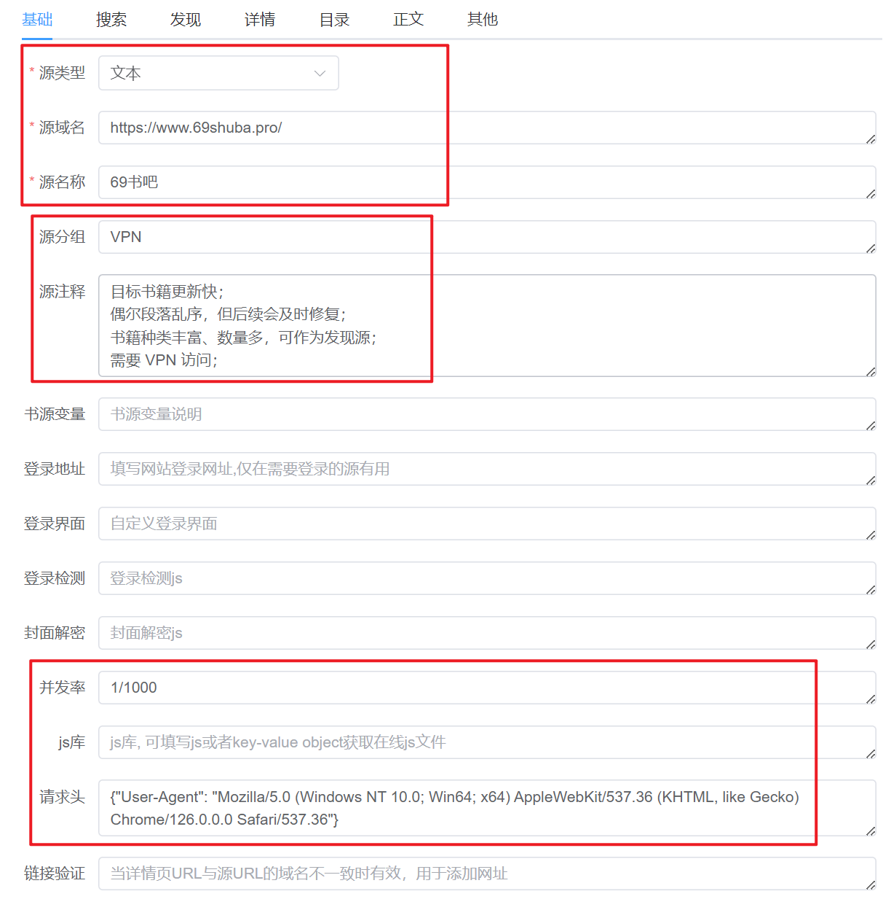
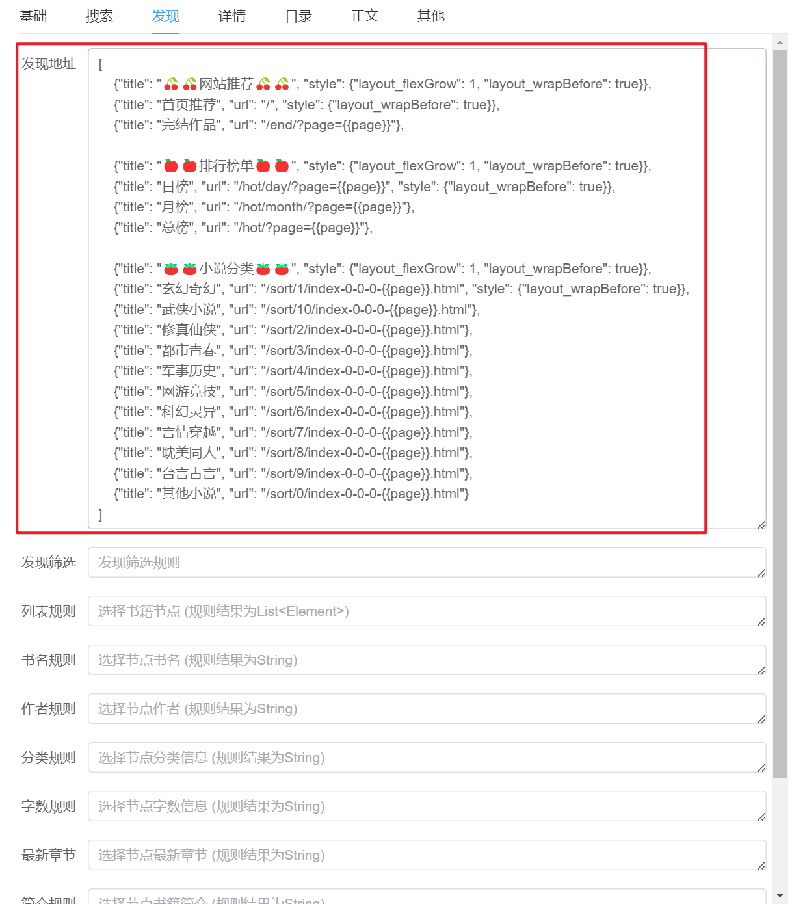
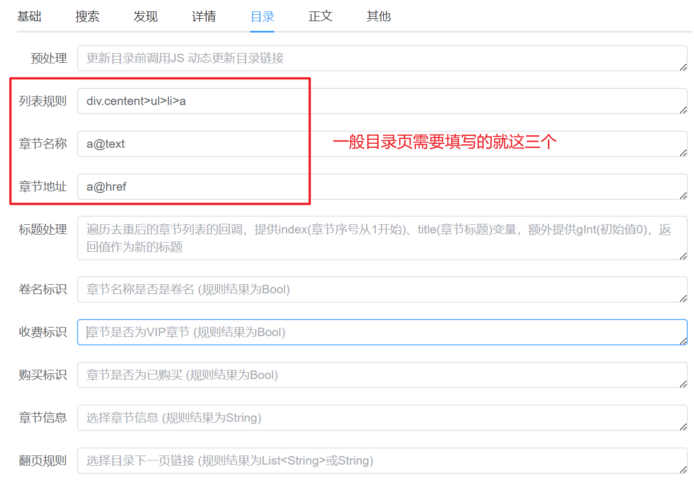

# Book Source Tutorial

本文档为 Legado 书源制作的教程文档，记录了本项目中制作书源所需的绝大部分内容。  

> 本文档以官方的 [Legado书源规则说明](https://mgz0227.github.io/The-tutorial-of-Legado/Rule/source.html) 为基础进行编写。  


## 资料列表

以下为可能需要的资料参考列表：  

|序号|文档|说明|地址|
|:---:|---|---|---|
|01|Legado书源规则说明|书源制作规则说明|[在线文档](https://mgz0227.github.io/The-tutorial-of-Legado/Rule/source.html)|
|02|CSS 选择器|用于选取网页的元素，例如作者、字数、章节、标签|[在线文档](https://www.runoob.com/cssref/css-selectors.html)|
|03|JsonPath基本用法|用于选取 Json 数据，一般是处理 URL 的响应体|[在线文档](https://www.cnblogs.com/youring2/p/10942728.html)|
|04|阅读书源制作|Bilibili 上的系列教学视频，帮助理解书源中 JS 的用法|[在线视频](https://www.bilibili.com/video/BV1fg4y1Z7zz/?spm_id_from=333.788&vd_source=e93db8e283df4aca468f401c43d14444)|


## 规则语法

Legado 软件中书源的制作有 **70%** 以上的输入框需要使用到规则语法。  

本部分着重列出项目中所用的规则语法。  


### JSOUP 规则

该规则为书源制作的 **默认规则** ，同时 **兼容 CSS 选择器** 语法。  

作为默认规则，该规则无需额外声明即可使用。  

- JSOUP 规则语法如下：  
    ```
    ▲ @为分隔符,用来分隔获取规则
     ·每段规则可分为3段
     ·第一段是类型,如class,id,tag,text,children等, children获取所有子标签,不需要第二段和第三段,text可以根据文本内容获取
     ·第二段是名称,text. 第二段为文本内容的一部分
     ·第三段是位置,class,tag,id等会获取到多个,所以要加位置
     ·如不加位置会获取所有
     ·位置正着数从0开始,0是第一个,如为负数则是取倒着数的值,-1为倒数第一个,-2为倒数第二个
     ·!是排除,有些位置不符合需要排除用!,后面的序号用:隔开0是第1个,负数为倒数序号,-1最后一个,-2倒数第2个,依次
     ·获取列表的最前面加上负号- 可以使列表倒置,有些网站目录列表是倒的,前面加个负号可变为正的
     ·@的最后一段为获取内容,如text,textNodes,ownText,href,src,html,all等
     ·如需要正则替换在最后加上 ##正则表达式##替换内容，替换内容为空时，第二个##可以省略
     ·例:class.odd.0@tag.a.0@text||tag.dd.0@tag.h1@text##全文阅读
     ·例:class.odd.0@tag.a.0@text&&tag.dd.0@tag.h1@text##全文阅读
    
    ▲ 增加支持类似数组的写法
     ·格式如:[index,index, ...]或[!index,index, ...],其中[!`开头表示筛选方式为排除,index可以是单个索引,也可以是区间
     ·区间格式为[start:end]或[start:end:step]，其中start为0时可省略，end为-1时可省略
     ·索引(index)、区间两端(start和end)、区间间隔(step)都支持负数
     ·特殊用法tag.div[-1:0],可在任意地方让列表反向
    ▲ 允许索引作为@分段后每个部分的首规则，此时相当于前面是children
     ·head@.1@text与head@[1]@text与head@children[1]@text等价
    ```

> 如果有 **CSS 选择器** 的语法知识，那么该规则的语法基本可以跳过。  
> 本项目中所使用的绝大部分规则均为 CSS 选择器语法规则。  


#### 元素属性

使用 CSS 选择器定位到的是 HTML 的元素，返回的结果也是 HTML 格式的元素内容。  

若想获取元素中的属性，可以参照以下表格中的方法（仅列出常用方法，其他方法需要自行探索）:  

  


### JSONPath 规则

该规则用于处理 Json 数据，本项目中仅使用过一次。  

- 规则语法 : [JsonPath基本用法 - 博客园](https://www.cnblogs.com/youring2/p/10942728.html)  
- 规则声明 : 以 `@json` 或者 `$.` 开头  


### JavaScript 规则

该规则中可以运行 JavaScript 代码，用于处理复杂请求或文本。  

- 规则声明 : 以 `<js></js>` 或者 `{{}}` 包围 JavaScript 代码  


### 正则净化

该规则是正则表达式的使用，主要用于净化文本内容。  

- 规则声明 : `##正则表达式##替换的文本`  


### 符号连接

符号用于连接同种规则，可以在一个输入框中使用多条规则（不包括 JS 和正则）。  

- 符号 : `&&`  
    - 用于连接同种规则的内容，并以英文逗号分隔  
- 符号 : `||`  
    - 会以第一个取到值的为准  
- 符号 : `%%`  
    - 会依次取数，如三个列表：  
        - 先取列表1的第一个，再取列表2的第一个，再取列表3的第一个  
        - 再取列表1的第二个，再取列表2的第二个...  

> 只用过 `&&` 符号，剩下两个符号我也不懂咋用。  


### 特殊规则

本部分为 Legado 书源中的特殊规则。  


#### URL 的 GET 请求

- 格式一：直接填写 URL 地址  
    ```
    https://www.baidu.com
    ```
- 格式二：填写 URL 地址，后接字符编码、请求头等内容  
    ```
    https://www.baidu.com, {
        "charset": "gbk",
        "webView": true,
        "headers": {"User-Agent":"Mozilla/5.0 (Windows NT 10.0; Win64; x64) AppleWebKit/537.36 (KHTML, like Gecko) Chrome/77.0.3865.120 Safari/537.36"}
    }
    ```
    > charset为utf-8时可省略，无特殊情况不需要请求头和webView，参数webView非空时采用webView加载  
    

#### URL 的 POST 请求

- 格式一：填写 URL 地址，后接字符编码、请求体、请求头等内容  
    ```
    https://www.baidu.com, {
        "charset": "gbk",
        "method": "POST",
        "body": "bid=10086",
        "webView": true,
        "headers": {"User-Agent":"Mozilla/5.0 (Windows NT 10.0; Win64; x64) AppleWebKit/537.36 (KHTML, like Gecko) Chrome/77.0.3865.120 Safari/537.36"}
    }
    ```
    > body是请求体，charset为utf-8时可省略，无特殊情况不需要请求头和webView，参数webView非空时采用webView加载  


#### 变量的传递

需要保存自定义变量时，可以用 `java.put(key,value)` 方法和 `java.get(key)` 方法， **这两个方法只能在 JS 中使用** 。  

- `java.put(key,value)` 方法：将 `value` 保存至 `key` 中（类似 Python 中向字典 key 键添加值）；  
    - 例子：向 `searchUrl` 键中添加值 `https://www.baidu.com`  
        ```js
        <js>
        java.put("searchUrl","https://www.baidu.com");
        </js>
        ```
        > 如果没有 `searchUrl` 键，则会自动创建  
- `java.get(key)` 方法：获取 `key` 对应的 `value` 值（类似 Python 中获取字典 key 键的值）  
    - 例子：获取 `searchUrl` 键中的值并打印  
        ```js
        <js>
        java.log(java.get("searchUrl"))
        </js>
        ```


#### `{{}}` 规则

- 在 `{{}}` 中默认为 JS 语法；  
- 在搜索 URL 和发现 URL 的 `{{}}` 中只能使用 JS 语法；  
- 在搜索 URL 和发现 URL 以外的 `{{}}` 中使用其他语法需要声明；  
    - 在 `{{}}` 中使用 JSOUP 规则（以 `@@` 开头）==> `{{@@div.author@text}}`  
    - 在 `{{}}` 中使用 XPath 规则（以 `@xpath` 或 `//` 开头）==> `{{@xpath:/html/body/div}}`  
    - 在 `{{}}` 中使用 JSONPath 规则以 `@json` 或 `$.` 开头）==> `{{@json:$.title}}`  

---

- `<js></js>` 与 `{{}}` 的区别：  
    - `<js></js>` 规则：只能使用 JS 代码；  
    - `{{}}` 规则：默认为 JS 代码，但是也可以声明为其他规则；  

> 某些场景下， `{{result}}` 与 `<js>java.log(result)</js>` 是等效的；  


#### JS 变量和函数

使用 JS 语法时需要知道以下变量：  

```js
baseUrl     // 变量-当前url,String
result      // 变量-上一步的结果
book        // 变量-书籍类,方法见 io.legado.app.data.entities.Book
cookie      // 变量-cookie操作类,方法见 io.legado.app.help.http.CookieStore
cache       // 变量-缓存操作类,方法见 io.legado.app.help.CacheManager
chapter     // 变量-当前目录类,方法见 io.legado.app.data.entities.BookChapter
title       // 变量-当前标题,String
src         // 内容,源码
```

使用 JS 语法时需要知道以下函数，具体实现方式查看：[JsExtensions.kt - GitHub](https://github.com/gedoor/legado/blob/master/app/src/main/java/io/legado/app/help/JsExtensions.kt)  

```js
//访问网络，urlStr为url字符串，返回类型String?
java.ajax(urlStr: String)
​
//并发访问网络，urlList为url数组，返回StrResponse?的数组，若要获取body，需使用.body()
java.ajaxAll(urlList: Array<String>): Array<StrResponse?>
​
//访问网络，urlStr为url字符串，返回Response<String>，已废弃
java.connect(urlStr: String)
​
//文件下载，content为十六进制字符串，url用于生成文件名，返回String文件相对路径
java.downloadFile(content: String, url: String)
​
//实现重定向拦截，返回[Connection.Response](https://jsoup.org/apidocs/org/jsoup/Connection.Response.html)
java.get(url: String, headers: Map<String, String>)
java.post(urlStr: String, body: String, headers: Map<String, String>)
​
//实现cookie读取，返回String
java.getCookie(tag: String, key: String?)
​
//base64解码，返回类型String
java.base64Decode(str: String)
java.base64Decode(str: String, flags: Int)
​
//base64解码，返回类型ByteArray?
java.base64DecodeToByteArray(str: String?)
java.base64DecodeToByteArray(str: String?, flags: Int)
​
//base64编码，返回类型String?
java.base64Encode(str: String)
java.base64Encode(str: String, flags: Int)
    
//md5编码，返回类型String?
java.md5Encode(str: String)
java.md5Encode16(str: String)
​
//格式化时间戳，返回类型String
java.timeFormat(timestamp: Long)
java.timeFormat(time: String)
​
//utf8编码转gbk编码，返回String
java.utf8ToGbk(str: String)
​
//实现字符串的URI编码，enc为编码格式，返回String
java.encodeURI(str: String) //默认enc="UTF-8"
java.encodeURI(str: String, enc: String)
​
//html格式化，返回String
java.htmlFormat(str: String)
​
//获取本地文件,path为文件的相对路径,返回File
java.getFile(path: String)
​
//读取本地文件，返回ByteArray?
java.readFile(path: String)
​
//读取本地文本文件，charsetName为编码格式
java.readTxtFile(path: String)  //自动识别charsetName不一定准，乱码时请手动指定
java.readTxtFile(path: String, charsetName: String)
​
//删除文件或文件夹
deleteFile(path: String)
​
//zip文件解压，zipPath为压缩文件路径，返回String解压相对路径，会删除原文件只保留解压后的文件
java.unzipFile(zipPath: String)
​
//文件夹内所有文本文件读取，返回内容String，会删除文件夹
java.getTxtInFolder(unzipPath: String)
​
//获取网络zip文件中的数据，url为zip文件链接，path为所需获取文件在zip内的路径，返回文件数据String
java.getZipStringContent(url: String, path: String)
​
//获取网络zip文件中的数据，url为zip文件链接，path为所需获取文件在zip内的路径，返回文件数据ByteArray?
java.getZipByteArrayContent(url: String, path: String)
​
//解析字体,返回字体解析类QueryTTF?
java.queryBase64TTF(base64: String?)
​
//str支持url,本地文件,base64,自动判断,自动缓存,返回字体解析类QueryTTF?
java.queryTTF(str: String?)
​
//text为包含错误字体的内容，font1为错误的字体，font2为正确的字体，返回字体对应的字
java.replaceFont(text: String,font1: QueryTTF?,font2: QueryTTF?)
​
//输出调试日志
java.log(msg: String)
​
//AES解码为ByteArray?,str为传入的AES加密数据，key为AES解密key，transformation为AES加密方式，iv为ECB模式的偏移向量
java.aesDecodeToByteArray(str: String, key: String, transformation: String, iv: String)
​
//AES解码为String?,str为传入的AES加密数据，key为AES解密key，transformation为AES加密方式，iv为ECB模式的偏移向量
java.aesDecodeToString(str: String, key: String, transformation: String, iv: String)
​
//已经base64的AES解码为ByteArray?,str为Base64编码数据，key为AES解密key，transformation为AES加密方式，iv为ECB模式的偏移向量
java.aesBase64DecodeToByteArray(str: String, key: String, transformation: String, iv: String)
​
//已经base64的AES解码为String?,str为Base64编码数据，key为AES解密key，transformation为AES加密方式，iv为ECB模式的偏移向量
java.aesBase64DecodeToString(str: String, key: String, transformation: String, iv: String)
​
//加密aes为ByteArray?，data为传入的原始数据，key为AES解密key，transformation为AES加密方式，iv为ECB模式的偏移向量
java.aesEncodeToByteArray(data: String, key: String, transformation: String, iv: String)
​
//加密aes为String?，data为传入的原始数据，key为AES解密key，transformation为AES加密方式，iv为ECB模式的偏移向量
java.aesEncodeToString(data: String, key: String, transformation: String, iv: String)
​
//加密aes后Base64化的ByteArray?，data为传入的原始数据，key为AES解密key，transformation为AES加密方式，iv为ECB模式的偏移向量
java.aesEncodeToBase64ByteArray(data: String, key: String, transformation: String, iv: String)
​
//加密aes后Base64化的String?，data为传入的原始数据，key为AES解密key，transformation为AES加密方式，iv为ECB模式的偏移向量
java.aesEncodeToBase64String(data: String, key: String, transformation: String, iv: String)
​
/**************以下部分方法由于JAVA不支持参数默认值，调用时不能省略***************/
//设置需解析的内容content和baseUrl，返回类型AnalyzeRule
java.setContent(content: Any?, baseUrl: String? = this.baseUrl)
​
//输入规则rule和URL标志isUrl获取文本列表，返回类型List<String>?
java.getStringList(rule: String, isUrl: Boolean = false)
​
//输入规则rule和URL标志isUrl获取文本，返回类型String
java.getString(ruleStr: String?, isUrl: Boolean = false)
​
//输入规则ruleStr获取节点列表，返回类型List<Any>
java.getElements(ruleStr: String)
```


## 书源制作

本部分以例子说明 Legado 书源制作中的各种规则语法的使用。  

> 内容会有省略，建议对照查看 [Legado书源规则说明](https://mgz0227.github.io/The-tutorial-of-Legado/Rule/source.html) 文档。  

---

本项目书源的制作环境为：雷电模拟器 + Legado APP + Windows 11 + Chrome 浏览器  

> 奇怪，为什么我的雷电模拟器经常卡死啊。  
> 使用 【手机+电脑】 的组合，若电脑无法访问手机地址，可以试着 `ping` 一下手机的地址。  

---

浏览器可以将网页中的 HTML 元素复制为 CSS 选择器样式或者 XPath 样式。  

  


### 基础页

- 基础页没啥需要注意的，把必填项填了就行；  
      


### 搜索页

- 搜索页的列表规则最好尽可能详细，并且在详情页中没有与该规则匹配的元素；  
    - 当搜索页根据列表规则无法匹配到目标元素时，会直接进入详情页规则匹配；  
    - 有些网站搜索结果唯一时，会直接进入书籍详情页；  
- 搜索页中，搜索地址、列表规则、书名规则、详情地址为必填；  
      


### 发现页

- 发现页 `style` 属性可参考： [Android可伸缩布局－FlexboxLayout(支持RecyclerView集成) - 简书](https://www.jianshu.com/p/3c471953e36d)  
    - 基本上只用到 `layout_flexGrow` 属性和 `layout_wrapBefore` 属性  
- 发现页非必选，可以整个页面留空，不会影响到搜书功能；  
      


### 详情页

- 详情页中，书名规则为必填；  
      


### 目录页

- 目录页中，列表规则、章节名称、章节地址为必填；  
      


### 正文页

- 正文页中，正文规则为必填；  
      


### 其他页

- 其他页基本没啥需要注意的  
      


## 总结

本文内容到此结束，建议多参考其他人做的书源，以更好地学习如何制作书源。  

